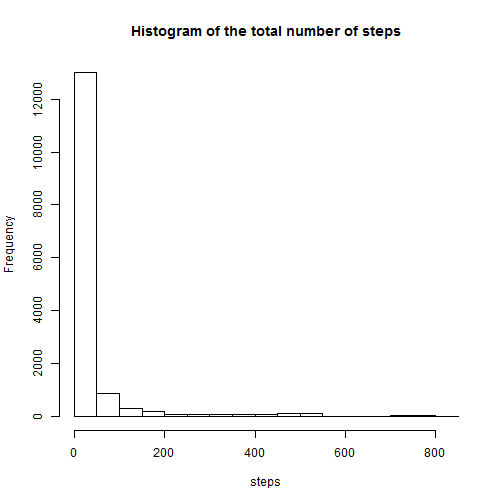
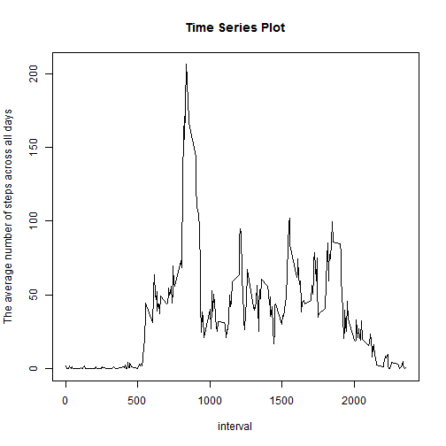
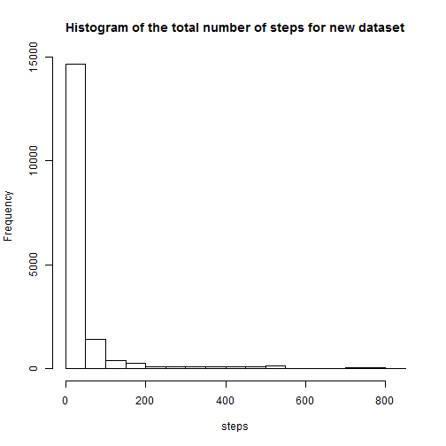
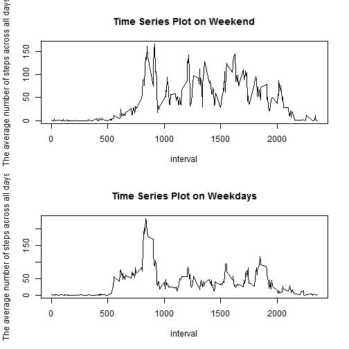

# Reproducible Research Peer Assessment 1

## Loading and preprocessing the data

Show any code that is needed to

1.Load the data (i.e. `read.csv()`)


```r
activity = read.table("activity.csv", header = TRUE, sep = ",")
head(activity)
```

```
##   steps       date interval
## 1    NA 2012-10-01        0
## 2    NA 2012-10-01        5
## 3    NA 2012-10-01       10
## 4    NA 2012-10-01       15
## 5    NA 2012-10-01       20
## 6    NA 2012-10-01       25
```


2.Process/transform the data (if necessary) into a format suitable for your analysis

**Remove missing values of steps**
  
  
  ```r
  activity.na.rm = activity[!is.na(activity$steps), ]
  head(activity.na.rm)
  ```
  
  ```
  ##     steps       date interval
  ## 289     0 2012-10-02        0
  ## 290     0 2012-10-02        5
  ## 291     0 2012-10-02       10
  ## 292     0 2012-10-02       15
  ## 293     0 2012-10-02       20
  ## 294     0 2012-10-02       25
  ```


## What is mean total number of steps taken per day?

For this part of the assignment, you can ignore the missing values in the dataset.

1.Make a histogram of the total number of steps taken each day


```r
hist(activity.na.rm$steps, main = "Histogram of the total number of steps", 
    xlab = "steps")
```

 


2.Calculate and report the **mean** and **median** total number of steps taken per day


```r
(tapply(activity.na.rm$steps, activity.na.rm$date, mean))
```

```
## 2012-10-01 2012-10-02 2012-10-03 2012-10-04 2012-10-05 2012-10-06 
##         NA     0.4375    39.4167    42.0694    46.1597    53.5417 
## 2012-10-07 2012-10-08 2012-10-09 2012-10-10 2012-10-11 2012-10-12 
##    38.2465         NA    44.4826    34.3750    35.7778    60.3542 
## 2012-10-13 2012-10-14 2012-10-15 2012-10-16 2012-10-17 2012-10-18 
##    43.1458    52.4236    35.2049    52.3750    46.7083    34.9167 
## 2012-10-19 2012-10-20 2012-10-21 2012-10-22 2012-10-23 2012-10-24 
##    41.0729    36.0938    30.6285    46.7361    30.9653    29.0104 
## 2012-10-25 2012-10-26 2012-10-27 2012-10-28 2012-10-29 2012-10-30 
##     8.6528    23.5347    35.1354    39.7847    17.4236    34.0938 
## 2012-10-31 2012-11-01 2012-11-02 2012-11-03 2012-11-04 2012-11-05 
##    53.5208         NA    36.8056    36.7049         NA    36.2465 
## 2012-11-06 2012-11-07 2012-11-08 2012-11-09 2012-11-10 2012-11-11 
##    28.9375    44.7326    11.1771         NA         NA    43.7778 
## 2012-11-12 2012-11-13 2012-11-14 2012-11-15 2012-11-16 2012-11-17 
##    37.3785    25.4722         NA     0.1424    18.8924    49.7882 
## 2012-11-18 2012-11-19 2012-11-20 2012-11-21 2012-11-22 2012-11-23 
##    52.4653    30.6979    15.5278    44.3993    70.9271    73.5903 
## 2012-11-24 2012-11-25 2012-11-26 2012-11-27 2012-11-28 2012-11-29 
##    50.2708    41.0903    38.7569    47.3819    35.3576    24.4688 
## 2012-11-30 
##         NA
```

```r
(tapply(activity.na.rm$steps, activity.na.rm$date, median))
```

```
## 2012-10-01 2012-10-02 2012-10-03 2012-10-04 2012-10-05 2012-10-06 
##         NA          0          0          0          0          0 
## 2012-10-07 2012-10-08 2012-10-09 2012-10-10 2012-10-11 2012-10-12 
##          0         NA          0          0          0          0 
## 2012-10-13 2012-10-14 2012-10-15 2012-10-16 2012-10-17 2012-10-18 
##          0          0          0          0          0          0 
## 2012-10-19 2012-10-20 2012-10-21 2012-10-22 2012-10-23 2012-10-24 
##          0          0          0          0          0          0 
## 2012-10-25 2012-10-26 2012-10-27 2012-10-28 2012-10-29 2012-10-30 
##          0          0          0          0          0          0 
## 2012-10-31 2012-11-01 2012-11-02 2012-11-03 2012-11-04 2012-11-05 
##          0         NA          0          0         NA          0 
## 2012-11-06 2012-11-07 2012-11-08 2012-11-09 2012-11-10 2012-11-11 
##          0          0          0         NA         NA          0 
## 2012-11-12 2012-11-13 2012-11-14 2012-11-15 2012-11-16 2012-11-17 
##          0          0         NA          0          0          0 
## 2012-11-18 2012-11-19 2012-11-20 2012-11-21 2012-11-22 2012-11-23 
##          0          0          0          0          0          0 
## 2012-11-24 2012-11-25 2012-11-26 2012-11-27 2012-11-28 2012-11-29 
##          0          0          0          0          0          0 
## 2012-11-30 
##         NA
```


## What is the average daily activity pattern?

1.Make a time series plot (i.e. `type = "l"`) of the 5-minute interval (x-axis) and the average number of steps taken, averaged across all days (y-axis)

```r
plot(unique(activity.na.rm$interval), as.numeric(tapply(activity.na.rm$steps, 
    activity.na.rm$interval, mean, simplify = FALSE)), type = "l", main = "Time Series Plot", 
    xlab = "interval", ylab = "The average number of steps across all days")
```

 


2.Which 5-minute interval, on average across all the days in the dataset, contains the maximum number of steps?


```r
activity.na.rm$interval[which(as.numeric(tapply(activity.na.rm$steps, activity.na.rm$interval, 
    mean, simplify = FALSE)) == max(as.numeric(tapply(activity.na.rm$steps, 
    activity.na.rm$interval, mean, simplify = FALSE))))]
```

```
## [1] 835
```


## Imputing missing values

Note that there are a number of days/intervals where there are missing values (coded as `NA`). The presence of missing days may introduce bias into some calculations or summaries of the data.

1.Calculate and report the total number of missing values in the dataset (i.e. the total number of rows with `NA`s)


```r
sum(is.na(activity$steps))
```

```
## [1] 2304
```


2.Devise a strategy for filling in all of the missing values in the dataset. The strategy does not need to be sophisticated. For example, you could use the mean/median for that day, or the mean for that 5-minute interval, etc.

**Use the mean for that 5-minute interval to replace missing data**
  
  3.Create a new dataset that is equal to the original dataset but with the missing data filled in.


```r
rep.val = numeric(sum(is.na(activity$steps)))
for (i in 1:sum(is.na(activity$steps))) {
    rep.val[i] = as.numeric(tapply(activity.na.rm$steps, activity.na.rm$interval, 
        mean, simplify = FALSE))[which(unique(activity.na.rm$interval) == activity[is.na(activity$steps), 
        3][i])]
}
activity[is.na(activity$steps), 1] = rep.val
head(activity)
```

```
##     steps       date interval
## 1 1.71698 2012-10-01        0
## 2 0.33962 2012-10-01        5
## 3 0.13208 2012-10-01       10
## 4 0.15094 2012-10-01       15
## 5 0.07547 2012-10-01       20
## 6 2.09434 2012-10-01       25
```


4.Make a histogram of the total number of steps taken each day and Calculate and report the **mean** and **median** total number of steps taken per day. Do these values differ from the estimates from the first part of the assignment? What is the impact of imputing missing data on the estimates of the total daily number of steps?


```r
hist(activity$steps, main = "Histogram of the total number of steps for new dataset", 
    xlab = "steps")
```

 


```r
(tapply(activity$steps, activity$date, mean))
```

```
## 2012-10-01 2012-10-02 2012-10-03 2012-10-04 2012-10-05 2012-10-06 
##    37.3826     0.4375    39.4167    42.0694    46.1597    53.5417 
## 2012-10-07 2012-10-08 2012-10-09 2012-10-10 2012-10-11 2012-10-12 
##    38.2465    37.3826    44.4826    34.3750    35.7778    60.3542 
## 2012-10-13 2012-10-14 2012-10-15 2012-10-16 2012-10-17 2012-10-18 
##    43.1458    52.4236    35.2049    52.3750    46.7083    34.9167 
## 2012-10-19 2012-10-20 2012-10-21 2012-10-22 2012-10-23 2012-10-24 
##    41.0729    36.0938    30.6285    46.7361    30.9653    29.0104 
## 2012-10-25 2012-10-26 2012-10-27 2012-10-28 2012-10-29 2012-10-30 
##     8.6528    23.5347    35.1354    39.7847    17.4236    34.0938 
## 2012-10-31 2012-11-01 2012-11-02 2012-11-03 2012-11-04 2012-11-05 
##    53.5208    37.3826    36.8056    36.7049    37.3826    36.2465 
## 2012-11-06 2012-11-07 2012-11-08 2012-11-09 2012-11-10 2012-11-11 
##    28.9375    44.7326    11.1771    37.3826    37.3826    43.7778 
## 2012-11-12 2012-11-13 2012-11-14 2012-11-15 2012-11-16 2012-11-17 
##    37.3785    25.4722    37.3826     0.1424    18.8924    49.7882 
## 2012-11-18 2012-11-19 2012-11-20 2012-11-21 2012-11-22 2012-11-23 
##    52.4653    30.6979    15.5278    44.3993    70.9271    73.5903 
## 2012-11-24 2012-11-25 2012-11-26 2012-11-27 2012-11-28 2012-11-29 
##    50.2708    41.0903    38.7569    47.3819    35.3576    24.4688 
## 2012-11-30 
##    37.3826
```

```r
(tapply(activity$steps, activity$date, median))
```

```
## 2012-10-01 2012-10-02 2012-10-03 2012-10-04 2012-10-05 2012-10-06 
##      34.11       0.00       0.00       0.00       0.00       0.00 
## 2012-10-07 2012-10-08 2012-10-09 2012-10-10 2012-10-11 2012-10-12 
##       0.00      34.11       0.00       0.00       0.00       0.00 
## 2012-10-13 2012-10-14 2012-10-15 2012-10-16 2012-10-17 2012-10-18 
##       0.00       0.00       0.00       0.00       0.00       0.00 
## 2012-10-19 2012-10-20 2012-10-21 2012-10-22 2012-10-23 2012-10-24 
##       0.00       0.00       0.00       0.00       0.00       0.00 
## 2012-10-25 2012-10-26 2012-10-27 2012-10-28 2012-10-29 2012-10-30 
##       0.00       0.00       0.00       0.00       0.00       0.00 
## 2012-10-31 2012-11-01 2012-11-02 2012-11-03 2012-11-04 2012-11-05 
##       0.00      34.11       0.00       0.00      34.11       0.00 
## 2012-11-06 2012-11-07 2012-11-08 2012-11-09 2012-11-10 2012-11-11 
##       0.00       0.00       0.00      34.11      34.11       0.00 
## 2012-11-12 2012-11-13 2012-11-14 2012-11-15 2012-11-16 2012-11-17 
##       0.00       0.00      34.11       0.00       0.00       0.00 
## 2012-11-18 2012-11-19 2012-11-20 2012-11-21 2012-11-22 2012-11-23 
##       0.00       0.00       0.00       0.00       0.00       0.00 
## 2012-11-24 2012-11-25 2012-11-26 2012-11-27 2012-11-28 2012-11-29 
##       0.00       0.00       0.00       0.00       0.00       0.00 
## 2012-11-30 
##      34.11
```


**The values differ from the estimates from the first part of the assignment and the distribution of steps is more positive skew**
  
  ## Are there differences in activity patterns between weekdays and weekends?
  
  For this part the `weekdays()` function may be of some help here. Use the dataset with the filled-in missing values for this part.

1.Create a new factor variable in the dataset with two levels – “weekday” and “weekend” indicating whether a given date is a weekday or weekend day.

**The new factor variable is 1 if a given date is a weekend day,0 otherwise**
  
  
  ```r
  activity$week = ifelse(weekdays(as.Date(activity$date, "%Y-%m-%d")) %in% c("星期六", 
      "星期日"), 1, 0)
  head(activity)
  ```
  
  ```
  ##     steps       date interval week
  ## 1 1.71698 2012-10-01        0    0
  ## 2 0.33962 2012-10-01        5    0
  ## 3 0.13208 2012-10-01       10    0
  ## 4 0.15094 2012-10-01       15    0
  ## 5 0.07547 2012-10-01       20    0
  ## 6 2.09434 2012-10-01       25    0
  ```


2.Make a panel plot containing a time series plot (i.e. `type = "l"`) of the 5-minute interval (x-axis) and the average number of steps taken, averaged across all weekday days or weekend days (y-axis). The plot should look something like the following, which was creating using **simulated data**:
  
  
  ```r
  par(mfrow = c(2, 1))
  activity.weekend = activity[activity$week == 1, ]
  activity.weekday = activity[activity$week == 0, ]
  plot(unique(activity.weekend$interval), as.numeric(tapply(activity.weekend$steps, 
      activity.weekend$interval, mean, simplify = FALSE)), type = "l", main = "Time Series Plot on Weekend", 
      xlab = "interval", ylab = "The average number of steps across all days")
  
  plot(unique(activity.weekday$interval), as.numeric(tapply(activity.weekday$steps, 
      activity.weekday$interval, mean, simplify = FALSE)), type = "l", main = "Time Series Plot on Weekdays", 
      xlab = "interval", ylab = "The average number of steps across all days")
  ```
  
   

